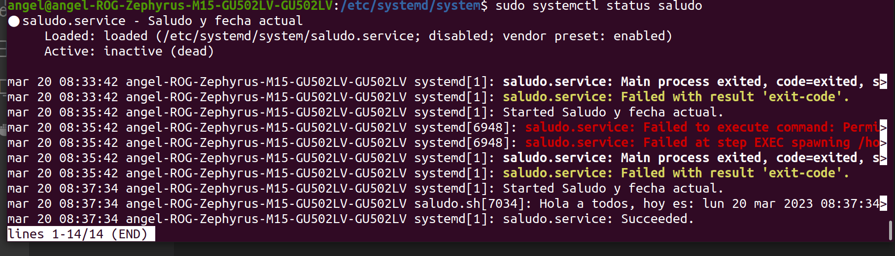

# ACTIVIDAD4

### Descripcion:
Crear un systemd unit de tipo servicio para ejecutar un script que imprima un saludo y fecha actual

## Proceso

### 1.Crear script con el nombre deseado. En mi caso usare saludo.sh con el contenido siguiente:

```bash
#!/bin/bash
echo "Hola a todos, hoy es: $(date)"
```

dar permisos para su ejecución

```bash
chmod +x {relativepath}/saludo.sh
```

### 2. Creo un archivo de configuración como saludo.service
```bash
[Unit]
Description=Saludo y fecha actual
[Service]
Type=simple
ExecStart={relative_path}/saludo.sh
[Install]
WantedBy=multi-user.target
```

### 3. Copiar el archivo al etc/systemd/system/ para que el servicio pueda ser lanzado por nuestra maquina

```bash
sudo cp saludo.service /etc/systemd/system/
```

### 4. Actualizar el sistema de unidades

```bash
sudo systemctl daemon-reload
```

### 5. Iniciar servicio
```bash
sudo systemctl start saludo
```


### 6. Ver status
```bash
sudo systemctl status saludo
```


### 7. Detener el servicio
```bash
sudo systemctl stop saludo
```